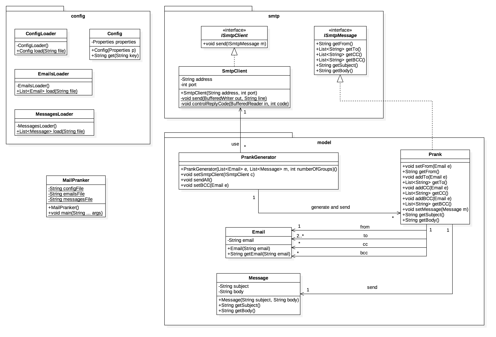

# Teaching-HEIGVD-RES-2016-Labo-SMTP

## Members

* **Sébstien Richoz**, sebastien.richoz1@heig-vd.ch
* **Damien Rochat**, damien.rochat@heig-vd.ch

## Description

This program is responsible for sending fake messages to a list of emails.

From lists of emails and messages, the application generate random groups of N emails and one message. One email is the sender, the others are the recipients.

## Configuration

Three configuration files allow to set application parameters (resources/config.properties) to define the list of emails (resources/emails.utf8) and define the messages to send (resources/messages.utf8).

The config.properties file must define : 

* **smtpServerAddress** and **smtpServerPort** : the SMTP configuration
* **sendBCCTo** : an email address that will receive a blinded carbon copy of all emails sent
* **numberOfGroups** : the number of group to create (a group corresponding to a prank).

## Execution

From the time when the configuration files have been filled, the application can be executed without arguments.

The project use Maven as build system :

* Build the project with the command : **mvn clean package**
* Execute the application with : **java -jar target/MailPranker-1.0.jar**
* Laugh!

## Execution of MockMock as SMTP test server

The MockMock project could be cloned from the repo : <https://github.com/tweakers-dev/MockMock>.

It provide a SMTP server that will intercept all the passing emails and provide a web interface to see them.
You need to build the project and execute the jar file to launch the server.

There is some options to define custom ports :

* **-p 2525** : the SMTP server will listen on the port 2525
* **-h 8080** : the HTTP server (for the web interface) will listen on the port 8080

For example : **java -jar MockMock-1.4.0.one-jar.jar -p 2525 -h 8080**

### Docker/Vagrant warning

If you use a virtualised environment, don't forget to map the ports of your VM to your host. Per example, you can execute PrankMailer and MockMock inside Vagrant and access the MockMock web interface with your favorite browser if you map your 8080 port to the Vagrant 8080 port.

## Implementation

There is three packages, for the config classes, the smtp classes, and the PrankMailer specifics classes.

The configuration load the three 