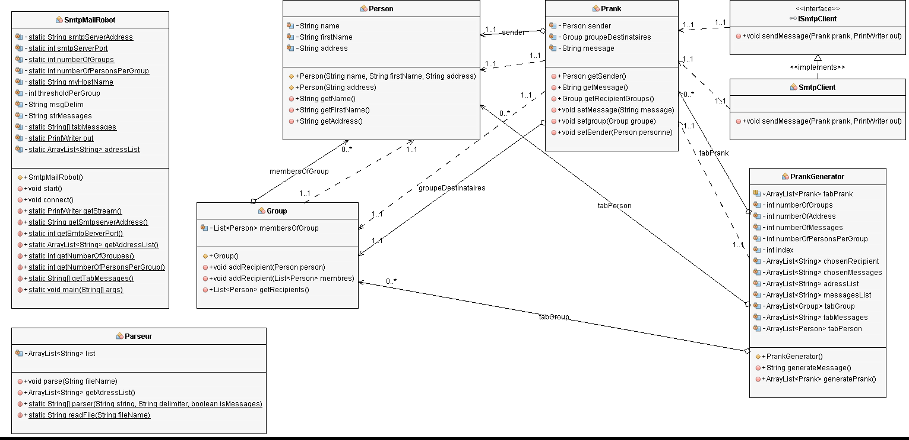

## REPORT
									Lab: SMTP client

We developed a client application (TCP) in Java. This client application will use the Socket API to communicate with a SMTP server and send automatically messages to many persons in a group.
 
## Description
This client application allows to send message to a recipient group.It use the socket API to communicate with a SMTP server. Thus, we must enter the number of the group and the number of person per group in the file `config.properties`. Then, this application creates random numbers of desired groupe and send a message to all the group's members. a recipient must be part of one group. And the message sent by the sender should be for the other members of the same group as him, and he himself must not receive the sent mail.

## Class diagram   

First we parse two files, one file containing the emails adresses and another one containing a list of messages. Then we create differents persons and groups randomly. The class prank generator helps us to create pranks which simulates the real telnet connexion to a server in order to send messages with subject, from, to, body. Finally we use a SMTP server to send message, here in our case the server Mock-Mock.

## Mock server
We chose MockMock as suggested by the teacher in his web cast to simulate a smtp server. First of all,  we install this mock server with a command `mvn clean install` then we enter into the target folder and generate, execute this command to launch mock mock `java -jar MockMock-1.4.0.one-jar.jar -p 2525`. Finally in the navigator enter to url `localhost:8282` to see the message send.